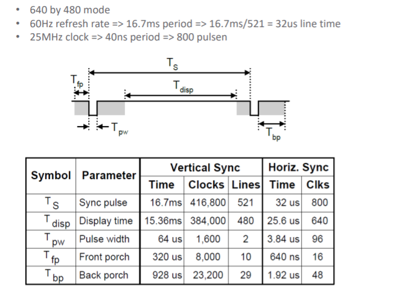
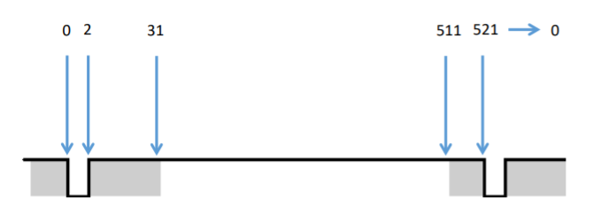

# Probleemstelling

Als extra heb ik 2 projecten gemaakt. 1 ervan is gelukt en kun je zelf uitbreiden en de andere is ook gelukt maar niet op een 'correcte' manier maar harcoded. De bedoeling is dat je verder gaat analyseren en het uitbreiden.

# Emoji 
Het project dat ik er aan gewerkt heb is een emoji via de vga poort op de scherm te tonen. Dit is een leuk concept om juist te beseffen hoe je via met de vga poort van de fpga of andere elektronische hardware ermee kunt spelen. Niet alleen is het gelukt om een emoji op mijn beeld te zetten maar ook frame per frame iets anders te laten doen. 

### VGA in FPGA
Om dit te kunnen laten werken zijn er verschillende manieren maar basis hiervan is dat je moet weten hoe juist de communicatie in vga werkt.

* vga
 

</img> 

Om met de vga te kunnen werken moeten we toch zel rekening houden met een paar dingens. Ten eerste is de vga 640x480, werkt op 60Hz en heeft een clock nodig van 25MHz.

* vga horizontal counter
 

</img> 

Bij de horizontal counter zien we dat we geen 640 hebben maar 800. Hoe kan dit ? dit kan omdat de eerste puls van 0-96 eigenlijk een waarschuwig puls is omdat het gaat "starten" van 96-144 gaat die wachten of toch niet op de scherm tonen en vanaf 144 tot 784 tekent die wat je maar wilt. daarna gaat die tot 800 tot die terug bij 0 begint.

* vga vertical counter
 

</img> 
 
 Bij de vertical counter doen we hetzelfde maar niet tot 800 maar tot 521 hier zien we weer dat de display time van 31 tot 511 gaat wat ons 480 geeft. 

### Wat hebben we nodig?

om met de fpga de vga te laten werken hebben we dus een clock nodig van 25MHz een vga blok van 640x480 en een blok te tekenen op het scherm. Een belangrijke concept over de vga is dat die maar 3 primaire kleuren heeft. Rood, blauw en groen. Hieronder zie je een foto van de pinnen van zo'n vga.

* vga pinout
 

</img> 

#### Clock
om zo'n clock te maken heb ik gebruik gemaakt van clock wizard die je terug kunt vinden bij IP catalog. hier kies je 25Hz als output clock. 

* video clock
 

<figure class="video_container">
  <iframe width="700" height="400" src="img/dsd.mp4" frameborder="0" allowfullscreen="true"> </iframe>
</figure>

### 640x480 blok
ik heb dit op mijn manier gedaan maar je kunt nog altijd betere en slimmere manieren vinden op het internet ( Voor verder te gaan maak zeker een verilog bestand aan geef die VGA_Driver als naam en kopier al de onderstaande code). Als eerste voeg je in de inputs en de outputs toe. Hier zien we dat ik bij elke kleur [3:0] zet. dit omdat de artix-7 elke kleur 4 keer heeft(bekijke afbeelding) en het zo vermeld staat in hun schema.
sync dient om te kunnen synchroniseren en counter om de pixels te tellen en naar de volgende blok door te geven. De blok om te teknen.  

    
    module VGA_driver (
    input clk,                // 25 MHz     
	input [3:0] i_red,        
	input [3:0] i_blue,      
	input [3:0] i_green,     
	output o_hsync,           
	output o_vsync,          
	output [9:0] o_hcounter,  
	output [9:0] o_vcounter,  
	output [3:0] o_red,      
	output [3:0] o_blue,      
	output [3:0] o_green       
   ); 

 

</img> 

Hier zet ik alles in een register die van 0 tot 9 gaat

	reg [9:0] r_hcounter = 0;  
	reg [9:0] r_vcounter = 0;   
	reg [3:0] r_red = 0;
	reg [3:0] r_blue = 0;
	reg [3:0] r_green = 0;

Het volgende moet je goed is kijken. Hier zeg ik dat wanneer er een positieve edge van de clock is het controleert of horizontal counter kleiner is dan 799 en dus begint te tellen tot 799. Daarna doe ik hetzelfde met de vertical counter.

	always @(posedge clk)  // horizontal counter
		begin 
			if (r_hcounter < 799)
				r_hcounter <= r_hcounter + 1;  // horizontal counter (including off-screen horizontal 160 pixels) total of 800 pixels 
			else
				r_hcounter <= 0;              
		end  // always 
	
	always @ (posedge clk)  // vertical counter
		begin 
			if (r_hcounter == 799)  // only counts up 1 count after horizontal finishes 800 counts
				begin
					if (r_vcounter < 525)  // vertical counter total of 525 pixels
						r_vcounter <= r_vcounter + 1;
					else
						r_vcounter <= 0;              
				end  // if (r_hcounter...
		end  // always

De laatste stappen is assign. Hier voeg ik alles bij elkaar. assign is eigenlijk koppelen met elkaar. ik koppel de o_hcounter wat de output is met r_hcounter en hetzelfde met v_counter

	assign o_hcounter = r_hcounter;
	assign o_vcounter = r_vcounter;

Als we terug naar de bovenste afbeelding gaan zien kun je zien dat bij de horizontale counter een hsync was van 0-96 en bij vsync 0-2. Dit is wat we hier ook doen.

	assign o_hsync = (r_hcounter >= 0 && r_hcounter < 96) ? 1:0;  // hsync high for 96 counts                                                 
	assign o_vsync = (r_vcounter >= 0 && r_vcounter < 2) ? 1:0;   // vsync high for 2 counts

En als laatste gaan we alleen de kleuren terugsturen de binnen de display time range zit.

    assign o_red = (r_hcounter > 144 && r_hcounter <= 783 && r_vcounter > 35 && r_vcounter <= 514) ? i_red : 4'h0;
	assign o_blue = (r_hcounter > 144 && r_hcounter <= 783 && r_vcounter > 35 && r_vcounter <= 514) ? i_blue : 4'h0;
	assign o_green = (r_hcounter > 144 && r_hcounter <= 783 && r_vcounter > 35 && r_vcounter <= 514) ? i_green : 4'h0;

Nu dat we dit gedaan hebben moeten we nog een paar dings doen en dan kunnen we beginnen met het tekenen!
Maak een verilog bestand aan en noem het vga_smiley. 

Dit is mijn teken blok dat ik gemaakt heb. is niet de meeste schone code maar het werkt. Hier zie je dat ik eerst de poorten declareer als input en output. de input poorten komen voornamelijk van de vga blok zodat we kunnen gaan tekenen. de output poorten verbind ik met de vga uitgang zodat we onze tekening op de scherm kunnen tonen. daarnaa maak ik een paar register aan die paar dingens gaan bijhouden. je ziet ook 4'h0 staan, dit is omdat ik zeg in hexadecimaal dat de kleur hier niet 'aan' moet staan. als ik dit aanpas naar bv. 4'hF geef dit mij de kleur terug. ik declareer verder 4 frames die ik gemaakt heb elke frame heeft zijn binaire waarde. 2'b00 betekendt dat het een binaire is en 2 bits groot. 

    module VGA_smiley (
	input clk, 
	input [9:0] i_counter_x,
	input [9:0] i_counter_y,
	output [3:0] o_red,
	output [3:0] o_blue,
	output [3:0] o_green
	);
	
	reg [26:0] clk_counter = 0;
	reg [1:0] FRAME = 0;
	reg [3:0] r_red = 4'h0;
	reg [3:0] r_blue = 4'h0;
	reg [3:0] r_green = 4'h0;
	
	localparam FRAME_1 = 2'b00;
	localparam FRAME_2 = 2'b01;
	localparam FRAME_3 = 2'b10;
	localparam FRAME_4 = 2'b11;

Bij de volgende code controleer ik als de clk counter onder de 79000000 is anders doe ik +1 zo kan ik een overzicht houden op hoeveel clk pulsen het momenteel staat en zo een bewegende animatie maken gebaseerd op frames. Dit kunnen we zien op de volgende code, hier zetten we een clk bereik en zeggen we wanneer frame 1 tot frame 4 moet starten.

	always @ (posedge clk)
		begin 
			if (clk_counter < 79000000)
				clk_counter <= clk_counter + 1;
			else 
				clk_counter <= 0;
		end 
		
	always @ (posedge clk) 
		begin 
			if (clk_counter < 25000000)
				FRAME <= FRAME_1;
			else if (clk_counter >= 25000000 && clk_counter < 27000000)
				FRAME <= FRAME_2;
			else if (clk_counter >= 27000000 && clk_counter < 29000000)
				FRAME <= FRAME_3;
			else if (clk_counter >= 29000000 && clk_counter < 75000000)
				FRAME <= FRAME_4;
			else if (clk_counter >= 75000000 && clk_counter < 77000000)
				FRAME <= FRAME_3;
			else if (clk_counter >= 77000000 && clk_counter < 79000001)
				FRAME <= FRAME_2;
		end 

Voor dat we echt beginnen te tekenen gaan we een assign doen zodat we de kleuren die we in de register hebben gestoken we sturen naar de ingang van de vga en dus op het scherm komt.

	assign o_red = r_red;
	assign o_blue = r_blue;
	assign o_green = r_green;

Hier gaan we weer een posedge doen en controlleren met een case welke frame het nu is. We kunnen tekenen door te zeggen dat binnen een bepaalde bereike die de kleur rood of blauw of green op 4'hF moet gaan zetten. I_counter_y bepaalde de verticale pixels waarde op de scherm en i_counter_x de horizontale pixels. als we dus links van boven willen iets willen tekenen moeten we dus if(i_counter_y >= 32 && i_counter_y < 35 && i_counter_x >= 144 && i_counter_y < 150)r_red <= 4'hF; nu kunnen we iets links boven tekenen. maar waarom deze waardes? Denk eraan dat de v counter op 32 begint en h counter op 144 nu hebben we iets 6pixels breed en 3 pixels hoog getekend met de kleur rood. Als je dit nu wilt update dat die naar rechts gaan kun je dit update door gebruik te maken van FRAME2 en FRAME3 enz en de x en y locatie update. zo kun je zien dat uw punt beweegt.

	always @ (posedge clk)
		begin 
			case (FRAME)
				FRAME_1 : 
					begin 
						////////////////////////////////////////////////////////////////////////////////////// SECTION 1.1 (TOP OF SCREEN)
						if (i_counter_y < 135)
							begin              
								r_red <= 4'hF;    // white
								r_blue <= 4'hF;
								r_green <= 4'hF;
							end  // if (i_counter_y < 135)
						////////////////////////////////////////////////////////////////////////////////////// END SECTION 1.1 (TOP OF SCREEN)
						
						////////////////////////////////////////////////////////////////////////////////////// END SECTION 1.2 (FOREHEAD)
						
						else if (i_counter_y >= 135 && i_counter_y < 150)
                                      begin 
                                      if (i_counter_x < 324)
                                      begin 
                                        r_red <= 4'hF;    // white
                                        r_blue <= 4'hF;
                                        r_green <= 4'hF;
                                      end  // if (i_counter_x < 324)
                                      else if (i_counter_x >= 324 && i_counter_x < 604)
                                  begin 
                                       r_red <= 4'hF;    // yellow
                                       r_blue <= 4'h0;
                                       r_green <= 4'hF;
                                 end  // else if (i_counter_x >= 324 && i_counter_x < 604)
                                 else if (i_counter_x >= 604)
                                 begin 
                                        r_red <= 4'hF;    // white
                                        r_blue <= 4'hF;
                                        r_green <= 4'hF;
                                 end  // else if (i_counter_x >= 604)
                            end  // else if (i_counter_y >= 135 && i_counter_y < 205)
						
						/////////////

Als laatste maak je een top blok en declareer je alle inputs en outputs en de verbindingen. Hieronder vind je de code. 

	`timescale 1ns / 1ps

	module VGA_smiley_top(
	input clk,
	output o_hsync,           
	output o_vsync,
	output [3:0] o_red,       // output color red
	output [3:0] o_blue,      // output color blue
	output [3:0] o_green
	);
	
	wire clk25MHz;
	
	wire [9:0] w_counter_x;
	wire [9:0] w_counter_y;
	wire [3:0] w_red;
	wire [3:0] w_blue;
	wire [3:0] w_green;
	
	clk_wiz_0 clk25hertz(
            .clk_in1(clk),
            .clk_out1(clk25)
            );
	
	VGA_smiley vs0 (
		.clk (clk25),
		.i_counter_x(w_counter_x),
		.i_counter_y(w_counter_y),
		.o_red(w_red),
		.o_blue(w_blue),
		.o_green(w_green)
		);
		
	VGA_driver vd0(
		.clk(clk25),
		.i_red(w_red),
		.i_blue(w_blue),
		.i_green(w_green),
		.o_hsync(o_hsync),
		.o_vsync(o_vsync),
		.o_hcounter(w_counter_x),
		.o_vcounter(w_counter_y),
		.o_red(o_red),
		.o_blue(o_blue),
		.o_green(o_green)
		);

	endmodule

Dit is een leuk project om de werking van de vga beter te begrijpen en zelf ermee te spelen.

P.s.
Dit is wat ik gemaakt heb.

 

<figure class="video_container">
  <iframe width="700" height="400" src="img/smile.mp4" frameborder="0" allowfullscreen="true"> </iframe>
</figure>

#### schema met vd0 als vga blok en vs0 als teken blok 
 

</img> 

# Tic Tac Toe
Hier is niet alles gelukt zoals ik het wou maar maar de basis is volledig afgeraakt dus geef ik hier toch wat extra uitleg over de werking en wat ik in gedachten had. Maar natuurlijk is het de bedoeling dat jij verder aan dit werkt. Om mogelijk te kunnen maken wat ik heb gemaakt heb je sommige stuk code van het vorige project nodig. Hier maak je  gebruik van een vga blok en een teken blok. 

#### werking
De bedoeling hier is dat je tic tac toe ga spelen met je partner. in mijn code heb ik 3 knoppen gedeclareerd . De bovenste om het vak te kunnen selecteren, de linkse om terug rechts bovenaan te beginnen te selecteren en ten laatste de rechts waar je na dat je het vak heb geselecteerd het vak gaat kunnen kleuren met je kleur(groen of blauw). 

 

</img> 

#### stap1: project aanmaken
We maken een top, vga_img (teken blok), vga_driver(vga blok) aan en kopieren alles van ervoor hierin. wat hier anders is dat we i.p.v een smiley we lijnen, blokken enz gaat tekenen. Daarna maken we ook 2 buttons projecten aan, een refreshcounter, anodecontrol, bcdcontrol en een 7segment 

#### stap 2: buttons
We maken hier 3 knoppen aan. Eerste is een next button waar we 2 inputs hebben 1 van de linkse knop die alles gaat resetten en de andere van de bovenste knop waar we vak per vak gaan selecteren. De assign moet niet maar is aangeraden om de output te kunnen controleren, als de led1 aan gaat dan staat count[0] op 1 enz. voor derest zeggen we hier dat het moet tellen tot 9 en na negen we terug gaan moeten beginnen van 0 of als we de reset knop drukken we weer bij 1 beginnen. 

	module buttonpress(
    	input  button,
    	input  reset,
    	output  led,
    	output  led2,
    	output  led3,
    	output  led4,
    	output reg [3:0]count
	);

	always @ (posedge button or posedge reset )
 		begin
  		if (reset || count >= 4'b1001)
   			count <= 4'b0001;
  		else if (button)
   			count <= count + 1;
 	end

 
	assign led  = count[0];
	assign led2 = count[1];
	assign led3 = count[2];
	assign led4 = count[3];

	endmodule

next blok 

</img> 

Bij de select button blok gaan we hier hetzelfde doen maar ipv tot 9 maar tot 1 en we sturen telkens de waarde van count naar onze teken blok (lijnen) om telkens een vak te selecteren.

	module button_select(
    	input  button2,    
    	input  reset,
    	input  reset2,
    	output  led5,
    	output reg flag,
    	output reg [1:0]count2
    );

 		always @ (posedge button2 or posedge reset or posedge reset2)
 		 begin
  			if(reset || reset2)
  			 begin
   				count2 <= 2'b00;
   				flag <= 1'b0;
   			 end
  			else if(count2 >= 2'b01)
  		 begin
   			flag <= 1'b1;
   			count2 <= 2'b00;
  		 end
  			else if(button2)
   			 count2 <= count2 + 1;
 		end
 
  	assign led5 = count2[0];
  	endmodule

select blok

</img> 

#### stap 3: in en out-puts, reg, parameters declareren van teken blok 
We verwijderen de code van de teken blok van het vorige project en vervangen het met het volgende code. 

module vga_img (
	input clk, 
	input reset,
	output  reg reset_spel = 0,
	input  [3:0] digit,
	input  [3:0] select,
	input  [9:0] i_counter_x,
	input  [9:0] i_counter_y,
	output  [3:0] o_red,
	output  [3:0] o_blue,
	output  [3:0] o_green,
	output  led0,
	output  led6,
	output  led7,   
    output  led8,
    output  led9, 
	output  led10,
    output  led11,
    output  led12,
    output  led13,   
    output  led14,
    output  led15,
    output reg flagTurn,
    output  [3:0] finish_, 
    output  [3:0] finish2_
	);
	
	reg [3:0] finish;
	reg [3:0] finish2;
	reg [26:0] clk_counter = 0;
	reg [1:0] FRAME = 0;
	reg [3:0] r_red = 4'h0;
	reg [3:0] r_blue = 4'h0;
	reg [3:0] r_green = 4'h0;
	
    reg Flag1 = 0;
    reg Flag2 = 0;
    reg Flag3 = 0;
    reg Flag4 = 0;
    reg Flag5 = 0;
    reg Flag6 = 0;
    reg Flag7 = 0;
    reg Flag8 = 0;
    reg Flag9 = 0;
    
    
    reg player1_1 = 0;
    reg player1_2 = 0;
    reg player1_3 = 0;
    reg player1_4 = 0;
    reg player1_5 = 0;
    reg player1_6 = 0;
    reg player1_7 = 0;
    reg player1_8 = 0;
    reg player1_9 = 0;
    
    reg player2_1 = 0;
    reg player2_2 = 0;
    reg player2_3 = 0;
    reg player2_4 = 0;
    reg player2_5 = 0;
    reg player2_6 = 0;
    reg player2_7 = 0;
    reg player2_8 = 0;
    reg player2_9 = 0;
    
    reg p1_1 = 0;
    reg p1_2 = 0;
    reg p1_3 = 0;
    reg p1_4 = 0;
    reg p1_5 = 0;
    reg p1_6 = 0;
    reg p1_7 = 0;
    reg p1_8 = 0;
    reg p1_9 = 0;
    
    reg p2_1 = 0;
    reg p2_2 = 0;
    reg p2_3 = 0;
    reg p2_4 = 0;
    reg p2_5 = 0;
    reg p2_6 = 0;
    reg p2_7 = 0;
    reg p2_8 = 0;
    reg p2_9 = 0; 
    reg [1:0]turn;
	    
    reg spel = 0;
	localparam FRAME_1 = 2'b00;

We declareren hier alles wat we nodig gaan hebben. Ik weet dat het hardcoded is maar omwillen van tijdgebrek moest ik dit wel zo doen. Er zijn betere manieren waar je dit kunt doen. 

#### stap 4: always @

Om te kunnen kiezen wie juist aan de beurt is gebruiken we een select dat input is en dit gekoppeld is aan de output van het blok SELECT_BUTTON . wanneer de gebruiker erop klikt zal turn +1 gedaan worden en wanneer het groter is dan 1 bit gaat de flagturn aan. De flagturn is gekkopeld aan de ingang van de reset. Dus wat er gebeurt is dat reset = 1 waardoor turn terug 0 wordt. Hiermee bepalen we dus als speler1 aan de beurt is of speler 2.

	always @(posedge select or posedge reset)
	   begin
	    if(reset)
         begin
          turn <= 2'b00;
          flagTurn <= 1'b0;
        end
	    else if(turn > 2'b00)
          begin
             flagTurn <= 1'b1;
             turn <= 2'b00;
          end
	    else if(select)
	       turn <= turn + 1;
	   end
	
	always @ (posedge clk)	    
		begin 
			if (clk_counter < 79000000)
				clk_counter <= clk_counter + 1;
			else 
				clk_counter <= 0;
		end 
		
	always @ (posedge clk) 
		begin 
				FRAME <= FRAME_1;
		end 
	
	assign o_red = r_red;
	assign o_blue = r_blue;
	assign o_green = r_green;

#### stap 4: teken van lijnen en blokken en logica

De onderstaande code dient om de lijnen te tekenen. Hier heb ik een bereik van pixels gekozen en die een kleur gegeven. Er is zitten nog paar bugs in maar dit is de basis daarvan. We beginnen met een always clk om dit elke keer te doen als er een clock puls aanwezig is. Merk wel dat er reset_spel en spel hier op 0 staat. Dit houden we voor later. 

    always @ (posedge clk)
	  begin
	        reset_spel <= 0; 
           spel <= 0;
            if (i_counter_y >= 190 && i_counter_y < 197)
              begin 
                if (i_counter_x < 650)
                 begin 
                   r_red <= 4'hF;    // white
                   r_blue <= 4'hF;
                   r_green <= 4'hF;
                 end    
              end         
        else if( i_counter_y >= 355 && i_counter_y < 362)
              begin 
                 if (i_counter_x < 650)
                  begin 
                     r_red <= 4'hF;    // white
                     r_blue <= 4'hF;
                     r_green <= 4'hF;
                  end
              end
        else if( i_counter_x >= 317 && i_counter_x < 324)
              begin 
                 if (i_counter_y < 650)
                  begin 
                     r_red <= 4'hF;    // white
                     r_blue <= 4'hF;
                     r_green <= 4'hF;
                  end
              end 
        else if( i_counter_x >= 545 && i_counter_x < 552)
              begin 
                  if (i_counter_y < 650)
                   begin 
                       r_red <= 4'hF;    // white
                       r_blue <= 4'hF;
                       r_green <= 4'hF;
                   end
              end
             ////////////////////////////////////////                 
         else 
              r_red <= 4'h0;    // black
              r_blue <= 4'h0;
              r_green <= 4'h0;  

Eens dat we de lijnen getekend hebben gaan we een case doen om te zien in welke staat de next button is. we doen een case van 0001 to 1001. Eens dat het op 1 van deze waarde staat gaat het een rode vak tekenen. daarna controleren we als de speler het geselecteerd heeft. zo niet dan blijft het een rode vak, als het wel geselecteerd is dan zetten we de juiste flag op 1. 

vb. als het next button op 0110 staat dan tekent zich een rode kader en als select op 1 staat dan is flag 6 = 1 en spel_reset = 1. hiermee gaan we de select counter reseten en is het de beurt aan de volgende speler. 

	4'b0110:
              if (i_counter_x >= 572 && i_counter_x < 722) //x-as
                  begin  
                     if (i_counter_y >= 210 &&i_counter_y < 345)
                      begin                                  
                        if (i_counter_y >= 217 &&i_counter_y < 337 && i_counter_x >= 579 && i_counter_x < 715)                         
                            begin
                              r_red <= 4'h0;    // black
                              r_blue <= 4'h0;
                              r_green <= 4'h0;                        
                            end 
                          else if(select >= 4'b0001)
                            begin
                             Flag6 <= 1; 
                             reset_spel <= 1;
                            end 
                        else                    
                           r_red <= 4'hF;    // red
                           r_blue <= 4'h0;
                           r_green <= 4'h0;                      
                     end 
                 end  

Als flag 6 op 1 staat gaan we controleren wie zijn beurt het was door naar turn te kijken. Als turn 1 zetten we p1_(flag nummer) op 1 en player2_(flag nummer) op 1 zodat die dezelfde kleur in die vak zich behouden wanneer turn naar 0 verandert. 

        if( Flag6 )
            begin
              if( turn == 1 &&  player1_6 == 0) 
            begin                             
              p1_6 <= 1'b1;                   
              player2_6 <= 1'b1;              
            end                               
            if( turn == 0 &&  player2_6 == 0) 
            begin                             
              p2_6 <= 1'b1;                   
              player1_6 <= 1'b1;              
            end                                        
           end  

als p1_6 of p2_6 op 1 staat dan komt er een groen of blauwe vierkant

        if(p1_6 == 1)   
            begin        
              if (i_counter_x >= 572 && i_counter_x < 722) //x-as     
                  begin                                               
                     if (i_counter_y >= 210 &&i_counter_y < 345)      
                      begin                                           
                           r_red <= 4'h0;    // green                 
                           r_blue <= 4'h0;                            
                           r_green <= 4'hF;                           
                     end                                              
                 end                                                                           
            end          
         if(p2_6 == 1)   
            begin        
              if (i_counter_x >= 572 && i_counter_x < 722) //x-as
                  begin                                          
                     if (i_counter_y >= 210 &&i_counter_y < 345) 
                      begin                                      
                           r_red <= 4'h0;    // green            
                           r_blue <= 4'hF;                       
                           r_green <= 4'h0;                      
                     end                                         
                 end                                                                     
            end                   

We controlleren achteraf als we gewonnen zijn. Als er 3 naast elkaar zijn van dezelfde kleur gaan we spel op 1 zetten. We zien dat er ook een finish en finish2 aanwezig is. Hiermee gaan we de punten bewaren en dit als output van [3:0] 4 bits lang. Dit gaat vervolgens naar de bcdcontroller.

            /////////////////////////////////////////////kijken als er 3 naast elkaar zijn (blauw)
            if(  p2_1 == 1 && p2_2 == 1  && p2_3 == 1) 
             begin                 
                finish = finish +1;
                spel = 1;
             end 
            if(  p2_4 == 1 && p2_5 == 1  && p2_6 == 1) 
             begin  
                finish = finish +1;  
                spel = 1;                           
             end 
            if(  p2_7 == 1 && p2_8 == 1  && p2_9 == 1) 
             begin 
                finish <= finish +1;
                spel = 1;                                 
             end                                       
            if(  p2_1 == 1 && p2_4 == 1  && p2_7 == 1) 
             begin 
                finish = finish +1;
                spel = 1;                                
             end                                       
            if(  p2_2 == 1 && p2_5 == 1  && p2_8 == 1) 
             begin  
                finish = finish +1; 
                spel = 1;                              
             end                                       
            if(  p2_3 == 1 && p2_6 == 1  && p2_9 == 1) 
             begin 
                finish = finish +1; 
                spel = 1;                               
             end    
            else if(  p2_1 == 1 && p2_5 == 1  && p2_9 == 1) 
             begin 
                finish = finish +1;
                spel = 1;                               
             end   
            else if(  p2_3 == 1 && p2_5 == 1  && p2_7 == 1)
             begin                                    
                finish = finish +1;
                spel = 1;   
             end

Hetzelfde doen we als heel ons scherm vol staat en geen winnaar is, dan zetten we spel op 1 en resetten we alles.

              if(Flag1 == 1 && Flag2 == 1  && Flag3 == 1 && Flag4 == 1 && Flag5 == 1  && Flag6 == 1 && Flag7 == 1 && Flag8 == 1  && Flag9 == 1)
                  begin                                                                                                                 
                  spel = 1;                                                                                                   
                  end     

Als spel op 1 gezet wordt, resetten we alles en beginnen we terug. 
  
    if(spel == 1)
         begin
                   reset_spel <= 1;
                   Flag1 <= 0;     
                   Flag2 <= 0;     
                   Flag3 <= 0;     
                   Flag4 <= 0;     
                   Flag5 <= 0;     
                   Flag6 <= 0;     
                   Flag7 <= 0;     
                   Flag8 <= 0;     
                   Flag9 <= 0;     
                                   
                   player1_1 <= 0; 
                   player1_2 <= 0; 
                   player1_3 <= 0; 
                   player1_4 <= 0; 
                   player1_5 <= 0; 
                   player1_6 <= 0; 
                   player1_7 <= 0; 
                   player1_8 <= 0; 
                   player1_9 <= 0; 
                                   
                   player2_1 <= 0; 
                   player2_2 <= 0; 
                   player2_3 <= 0; 
                   player2_4 <= 0; 
                   player2_5 <= 0; 
                   player2_6 <= 0; 
                   player2_7 <= 0; 
                   player2_8 <= 0; 
                   player2_9 <= 0; 
                                   
                                   
                   p1_1 <= 0;      
                   p1_2 <= 0;      
                   p1_3 <= 0;      
                   p1_4 <= 0;      
                   p1_5 <= 0;      
                   p1_6 <= 0;      
                   p1_7 <= 0;      
                   p1_8 <= 0;      
                   p1_9 <= 0;      
                                   
                   p2_1 <= 0;      
                   p2_2 <= 0;      
                   p2_3 <= 0;      
                   p2_4 <= 0;      
                   p2_5 <= 0;      
                   p2_6 <= 0;      
                   p2_7 <= 0;      
                   p2_8 <= 0;      
                   p2_9 <= 0;                                      
            end
         

Als laatste koppelen we flag met een led zodat we kunnen zien welke flag er aan staat. Dit is een soort van hulp middel maar moet niet. 
finish_ en finish2_ zijn uitgangen dus zeggen we dat de waardes van finish en finish2 naar de uitgang moeten gestuurd worden. Deze waardes worden gestuurd naar de ingang van de bcdcounter.

  	 assign led7  = Flag1;
  	 assign led8  = Flag2;
  	 assign led9  = Flag3;
  	 assign led10 = Flag4; 
 	 assign led11 = Flag5;                  
  	 assign led12 = Flag6;
    assign led13 = Flag7; 
  	 assign led14 = Flag8; 
  	 assign led15 = Flag9; 
  	 assign led0 = turn[0];
  	 assign led6 = finish[0];
  	 assign finish_ = finish;
  	 assign finish2_ = finish2;

#### stap 5: refreshcounter

Hier is de bedoeling dat aan de ingang een clk puls komt van 10kHz. Dan gaan we tot 4 clk pulsen tellen en sturen we elke [1:0] 2 bits naar de output. ( 00 01 10 11).

	 module refreshcounter(
      input refresh_clock,
      output reg [1:0] refreshcounter =0
     );
    
	 always @(posedge refresh_clock) refreshcounter <= refreshcounter +1;
	 endmodule

#### stap 6: anodecounter

Hier krijgen we de 2 bits van de refreshcounter als input en gaan we zeggen dat bij een bepaalde count we de anode van de 7segment aan zullen maken. Bij 00 gaan we de eerste segment aanzetten bij 01 gaan we alles uitzetten enz. Dit gebeurt allemaal met een snelheid van 10khz omdat dit niet zichtbaar is voor onze ogen. 

    module anode_controler(
      input [1:0] refreshcounter, //10khz
      output reg [3:0] anode = 0
    );
    
    always @ (refreshcounter)
     begin
       case (refreshcounter)
         2'b00:
          anode <= 4'b1110; //anode 1 is aan 
         2'b01:              
          anode <= 4'b1111; //anode 2 is aan  
         2'b10:              
          anode <= 4'b1111; //anode 3 is aan  
         2'b11:              
          anode <= 4'b0111; //anode 4 is aan  
       endcase
    end

    endmodule

#### stap 7:bcdcounter

Hier krijgen we als input de 2 bits van de refreshcounter en finish, finish2 van de tekenblok. Hier zeggen we dat als de refrescounter op 00 staat dat de waarde van finish (we hebben dit gekoppeld aan de ingang van digit1) naar one_digit gestuurd moet worden en hetzelfde doen we met finish2 maar bij 11 ( d3 ) dit sturen we door naar de seven segment door. 

    `timescale 1ns / 1ps

    module BCD_control(
       input [3:0] digit1,
      input [3:0] digit2,
      input [1:0] refreshcounter,
      output reg [3:0] one_digit = 0
    );
    
    always @ (refreshcounter)
      begin
        case (refreshcounter)
            2'd0:
                one_digit  <= digit1; //anode 1 is aan 
            2'd1:                
                one_digit  <= 0;                      
            2'd2:                                                
                one_digit  <= 0;                      
            2'd3:
                one_digit  <= digit2; //anode 4 is aan
        endcase
      end    
    endmodule

#### stap 8: seven_segment

We krijgen als input de one digit en we controlleren bij de case welke nummber het staat. Daarna zeggen we dat de leds op de cathode aan
moeten gaan staan. Dit zorgt ervoor da we een nummer gaan kunnen zien op de 7 segment display.
    
     
    module segment(
     input [3:0] digit,
     output reg [7:0] cathode
    );
    
    always @ (digit)
    begin 
     case(digit)
       4'd0:
          cathode  <= 8'b11111111;  
       4'd1:                       
          cathode  <= 8'b11111001;   
       4'd2:                       
          cathode  <= 8'b10100100;   
       4'd3:                       
          cathode  <= 8'b10110000;   
       4'd4:                       
          cathode <= 8'b10011001;   
       4'd5:                       
          cathode <= 8'b10010010;     
       4'd6:                    
          cathode <= 8'b10000010;
       4'd7:                    
          cathode <= 8'b11111000;   
       4'd8:                    
          cathode <= 8'b10000000;   
       4'd9:                    
          cathode <= 8'b10010000;   
       default:
          cathode <= 8'b11111111;
     endcase    
    end 
  
    endmodule

#### stap 9: top_blok

    `timescale 1ns / 1ps

    module top(
    input button,
    input button2,
	 input clk,
	 input reset,
	 output o_hsync,           
	 output o_vsync,
	 output [3:0] o_red,       // output color red
	 output [3:0] o_blue,      // output color blue
	 output [3:0] o_green,
	 output led0,
	 output led,
    output led2,
    output led3,
    output led4,
    output led5,
    output led6,
    output led7,
    output led8,
    output led9,
    output led10,
    output led11,
    output led12,
    output  led13,
    output  led14,
    output  led15,
    output  [3:0] anode,
    output [7:0] cathode
	 );
	
	 wire [9:0] w_counter_x;
	 wire [9:0] w_counter_y;
	 wire [3:0] w_red;
	 wire [3:0] w_blue;
	 wire [3:0] w_green;
	 wire [3:0] counter;
	 wire [3:0] counter2;
	 wire clk25;	
	 wire r_clock =0;
	 wire flagout;
	 wire flagout2;
	 wire Q_out;
	 wire [3:0] finish;
	 wire [3:0] finish2;
	 wire [1:0] refresh_clock;
    wire [1:0] refreshcounter;
    wire [3:0] one_digit;
    wire reset_spel;

	
	   clk_wiz_1 clock25(
            .clk_in1(clk),
            .clk_out1(clk25),
            .reset(r_clock),
            .clk_out2(refresh_clock)
            );
	
	   VGA_driver vga(
         .clk(clk25),
         .i_red(w_red),
         .i_blue(w_blue),
         .i_green(w_green),
         .o_hsync(o_hsync),
         .o_vsync(o_vsync),
         .o_hcounter(w_counter_x),
         .o_vcounter(w_counter_y),
         .o_red(o_red),
         .o_blue(o_blue),
         .o_green(o_green)
         );

	   vga_img lijnen (
		.clk (clk25),
		.i_counter_x(w_counter_x),
		.i_counter_y(w_counter_y),
		.o_red(w_red),
		.o_blue(w_blue),
		.o_green(w_green),
		.digit(counter),
		.select(counter2),
        .led0(led0),
        .led6(led6),
        .led7(led7),
        .led8(led8),		
		.led9(led9),
        .led10(led10),
        .led11(led11),
        .led12(led12),       
		.led13(led13),
        .led14(led14),
        .led15(led15),
        .flagTurn(flagout2),
        .reset(flagout2),
        .finish_(finish),
        .finish2_(finish2),
        .reset_spel(reset_spel)
		);

	   buttonpress NEXT_BUTTON (
        .button(button),
        .reset(reset),
        .led(led),
        .led2(led2),
        .led3(led3),
        .led4(led4),
        .count(counter)
        );	
        
 	   button_select SELECT_BUTTON  (
        .button2(button2),
        .led5(led5),
        .count2(counter2),
        .flag(flagout),
        .reset(flagout),
        .reset2(reset_spel)
        ); 
     

     
     refreshcounter _refreshcounter(
        .refresh_clock(refresh_clock),
        .refreshcounter(refreshcounter)   
     ); 
     
     anode_controler anode_control(
        .refreshcounter(refreshcounter),
        .anode(anode)
        
     );
     
     BCD_control BCD(
        .digit1(finish),
        .digit2(finish2),
        .refreshcounter(refreshcounter),
        .one_digit(one_digit)
     );
     
     segment seven_segment(
        .digit(one_digit),
        .cathode(cathode)
     );    
   
	

      endmodule

#### TOP SCHEMA

</img> 

 

<figure class="video_container">
  <iframe width="700" height="400" src="img/tictactoe.mp4" frameborder="0" allowfullscreen="true"> </iframe>
</figure>

# Problemen:

   - Alles werkt goed, alleen de kleur van de lijn staat gedifineert als wit maar op het scherm komt het rood.
   - De 7 segment display telt op maar overschrijft zich met de vorige waarde( leds van anode 1 telt zich op bij anode 4)

# Todo:

 - schonere code
 - betere benamingen
 - 7segment bug fix
 - pixels op een beter manier tekenen
 - eventueel text op scherm 

 