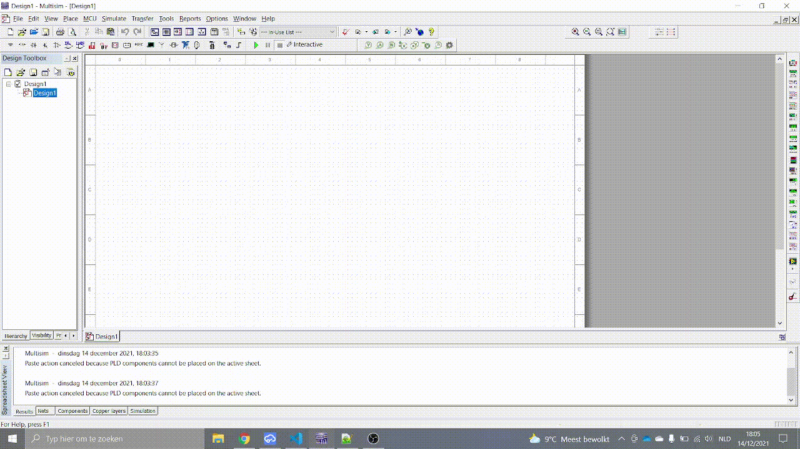
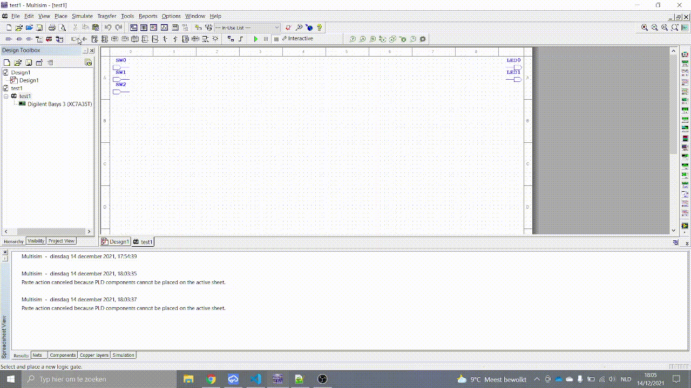
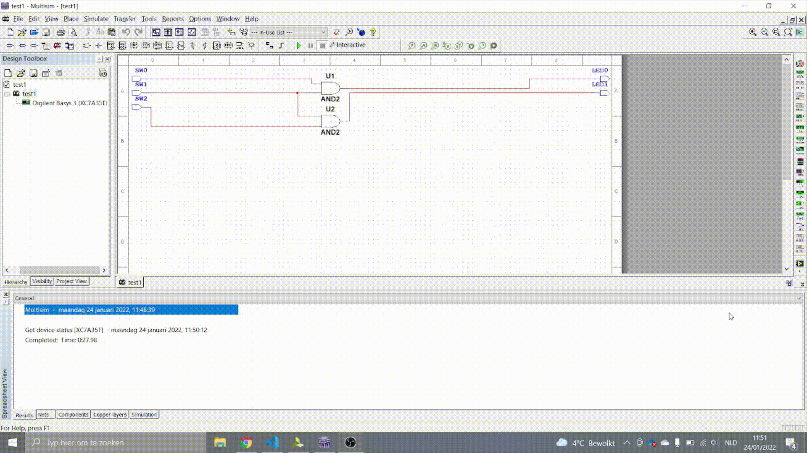

# **Oplossing**

# Multisim

### intro
Het probleem dat ik wou oplossen is dat ik een simpele schakeling op multism wou bouwen en deze dat naar de FPGA te zetten zonder Verilog of VHDL code te schrijven. Als je deze stappen volgt dan zou je zonder probleem een multisim schakeling naar de FPGA kunnen overbrengen. 

## Stap 1
Je opent multisim en je maakt een PLD project aan. Hier ga je het volgende moeten kiezen:
 - welke FPGA bord je wilt programmeren. 
 - projectnaam
 - componenten die je op de fpga wilt gebruiken.

</img> 
 

## Stap 2
Nu maak je een schakeling met de gate poorten of flipflops naar keuze. in mijn geval heb ik een simpele schakeling gemaakt met 2 AND poorten.

</img> 
 

## Stap3

Wanneer je klaar bent met je schakeling klik je bovenaan op transfer en kies je dan Export to PLD. Vervolgens opent zich een venster. Nu klik je gewoon next.  

</img> 
 

Nu zie je een venster en juist in het midden zie je Device. Bij jou staat er waarschijnlijk no Device of not cheked, dit komt omdat die de FPGA niet vind of omdat het programma het nog niet gecontrollerd heeft. je moet nu de fpga eerst in de computer moet aansluiten of als dit al gebeurt is moet je gewoon op de refresh knop drukken. Nu gaat multisim de FPGA bord proberen te vinden. Als het gevonden is gaat die onde Device erbij komen te staan als het niet gevonden is dat moet je best een andere kabel proberen of zien dat je fpga wel aan staat. Een andere probleem kan zijn dat de drivers niet geinstalleerd zijn dus moet je ze gewoon gaan installeren ( meer info hier: https://connecttech.com/resource-center/universal-fpga-driver-installation-guide-for-windows/ )

</img> 
 

## Stap 4

Als je alle stappen hebt gevolgd dan moet je gewoon op finish klikken. Multisim gaat nu verbinding maken met vivado en automatisch een constraint , top en bit file aanmaken. Daarna upload die het bestand naar de FPGA en zou je zelf gemaakte schakeling lukken op de FPGA.

<figure class="video_container">
  <iframe width="700" height="400" src="img/dsd2.mp4" frameborder="0" allowfullscreen="true"> </iframe>
</figure>

Als je naar de contraint en top bestanden dat multisim gemaakt heeft wilt gaan zien dan moet je deze Path ( C:\"pcnaam"\"gebruiker"\AppData\Local\National Instruments ) volgen. Hierin vind je alles terug van je schakeling. Je opent dit best wel met Vivado. 

