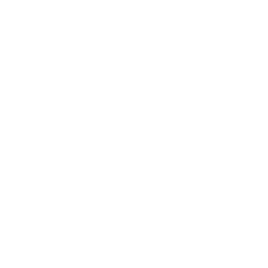

# **Probleemstellingen**

# Probleemstelling1
Eerste jaar studenten weten niet direct hoe je een FPGA juist moet gaan programmeren dus laat staan dat ze de FPGA taal verilog of VHDL snel van vanbuiten moeten leren. Wat wel mogelijk is om snel multisim te leren en een simpele schakeling te bouwen, dit is een van de doelstellingen dus zou iedereen het moeten kunnen. Als oplossing hiervoor maak ik een simpele document met stappen om een multisim bestand om te zetten in verilog / VHDL zonder enige code ervoor te schrijven. zo kunnen de eerste jaars makkelijk een FPGA "programmeren" en hun schakeling met echte hardware zien werken.  

 

</img>
</img>
</img>

 

# Probleemstelling2
Deze probleemstelling is wat voor geavanceerde studenten. Wat we hiermee willen bereiken is geen connectie van de multisim maar dan van scilab. Scilab is een programma zoals Matlab waar je wiskundige algoritme kunt schrijven en oplossen. Deze taal trek veel op de structuur van python en is dus makkelijk om snel te leren. Scilab kan geen rechtstreekse communicatie houden met de FPGA dus daarvoor gaan we voor jullie stappen voorzien hoe je het best moet doen om een simpele algoritme te schrijven vanuit scilab naar de fpga en dus het ook visueel te kunnen zien op de FPGA.

 

</img>
</img>
</img>

